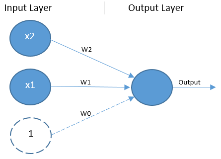
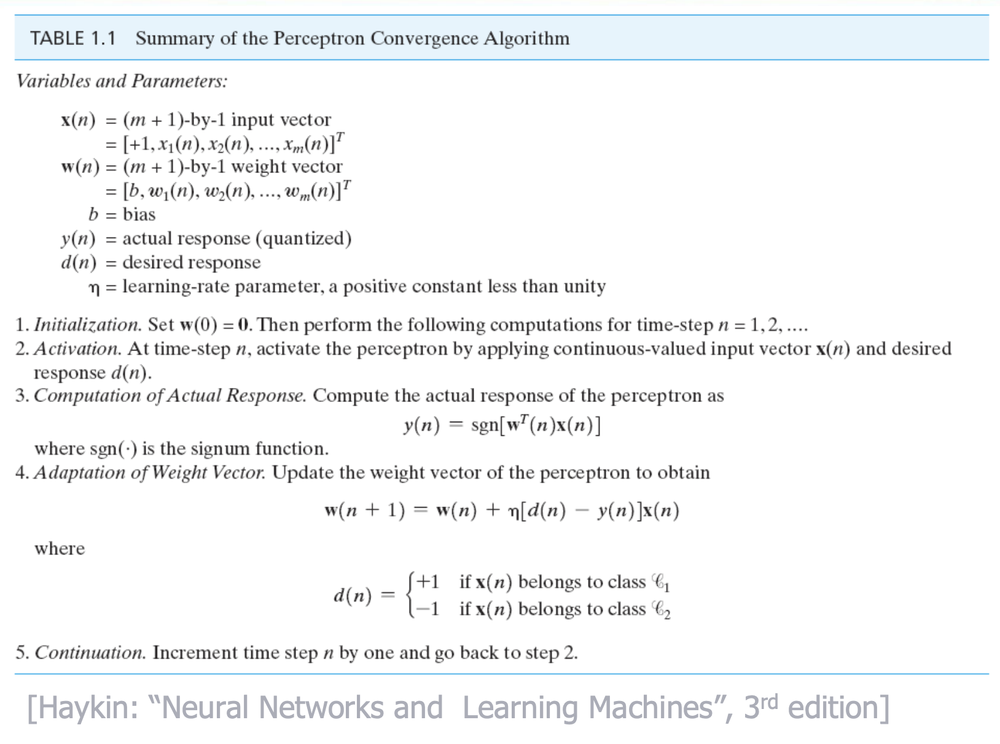
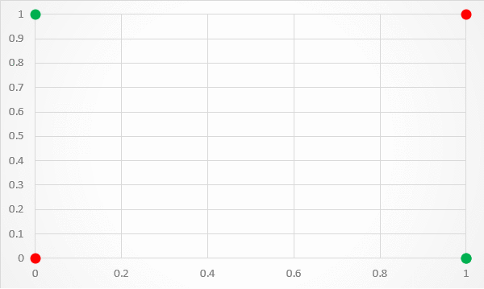
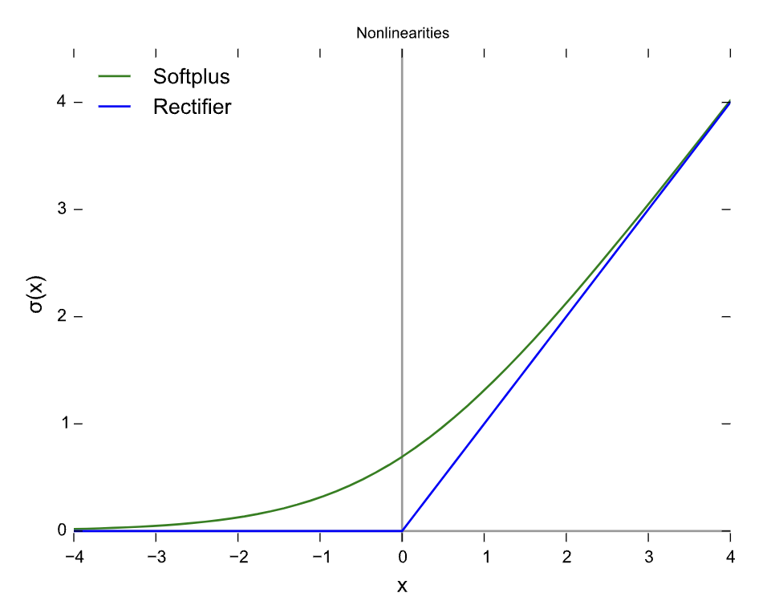
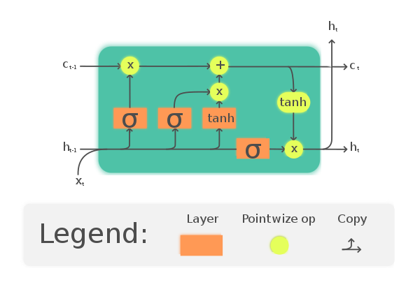
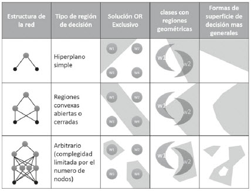
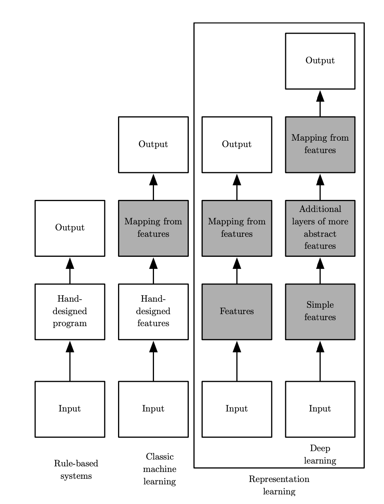
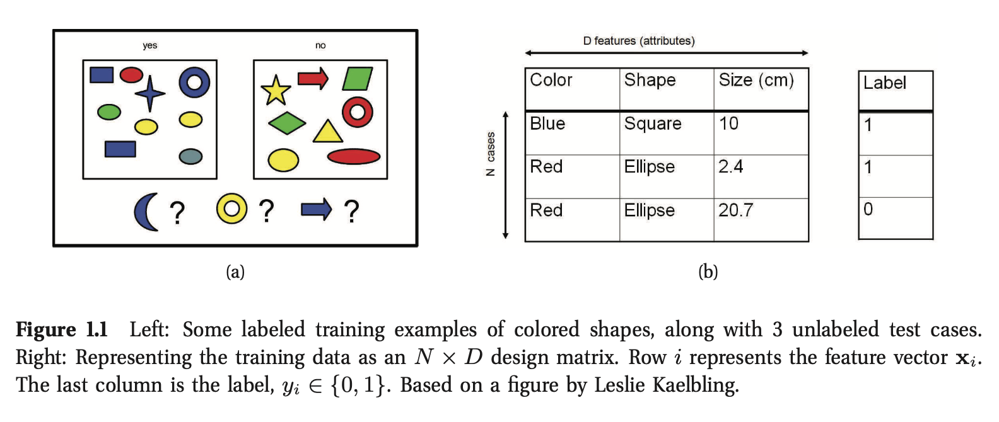
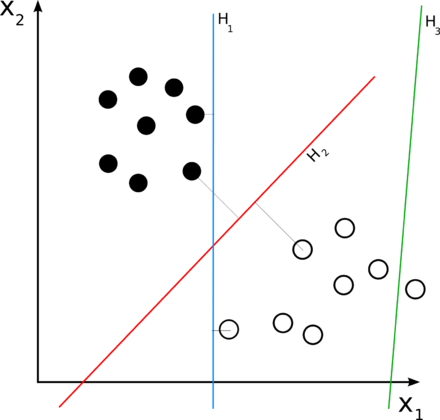
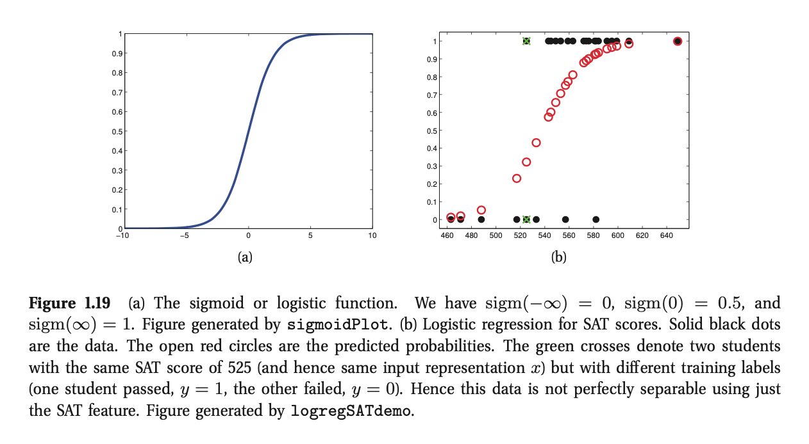

# Introducción al Aprendizaje Profundo


Dr. Rodrigo López Farías

Desde la aparición de los primeros diseños de computadoras (La Máquina Analítica de Charles Babage), la gente se preguntó si estas podían ser o imitar la inteligencia.

La inteligencia artificial es un campo de las ciencias computacionales fértil y próspero en aplicaciones e investigación.

El software inteligente es utilizado para automatizar tareas que fueron o son propias de la actividad humana. 

En los primeros días de la inteligencia artificial, este campo tomó y resolvió los primeros problemas que intelectualmente son difíciles para los humanos pero muy fáciles para las computadoras como:

* Programas que pueden ser descritos a través de reglas formales, e,g., utilizando matemáticas de lenguajes y autómatas.

Se intentó crear inteligencia artificial con codificación "dura". (Introducción explicita de reglas de inferencia en una base de datos llamado Enfoque de **Conocimiento Base** para la inteligencia artificial)

Bajo este paradigma los primeros éxitos de la inteligencia artificial se dieron en ambientes controlados en donde la computadora no requería obtener nueva experiencia para poder resolver un problema.

Como por ejemplo, un algoritmo basado en exploración de árboles para resolver la mejor jugada en un partidio de Ajedrez.


| |
|:--:|  
|*Utilizando esta idea la computadora IBM Deep Blue, ganó a Gary Kasparov en 1997.*|

Sin embargo, se ha criticado, este paradigma al carecer de mecanismos para adquirir conocimiento nuevo a partir de patrones de datos del ambiente.

Esta capacidad se le conoce como (En Inglés *Machine Learning*), Aprendizaje Automático (AA), Aprendizaje de Máquinas, Aprendizaje de Computadoras.

AA pudo hacer que las computadoras aborden problemas complejos para los humanos utilizando el conocimiento del mundo real  para tomar decisiones que parecen subjetivas. Por ejemplo, uno de los primeros éxitos es la implementación de una regresión logística simple que es capaz de recomendar o no parto por cesárea a los médicos (1990).  (Principio utilizado por las redes neuronales) 


El truco para que funcionen estos modelos reside en **una buena representación de los datos** que incluye una **selección de características** cuidadosa  por un experto.

Una mala selección o representación de datos, genera malos algoritmos predictivos. 

Una solución es utilizar AA para aprender la mejor representación de la información. A esto se le llama aprendizaje de representación (**Representation Learning**). 

El ejemplo representativo de Aprendizaje de representación, es el Autoencoder.

El verdadero reto de la inteligencia artificial es resolver tareas que son fáciles de ejecutar para los humanos pero dificiles de describir formalmente, como el reconocimiento de palabras, imágenes, sentimientos, entendimiento de patrones etc...

Ejemplos de problemas que son fáciles para los humanos pero difíciles para las computadoras.

* Entender el lenguaje natural.
* Inferir el sentimiento de las personas.
* Traducción Automática
* Clasificación de Imágenes.
* Reconocimiento de objetos.
* Qué otros problemas los humanos pueden resolver fácilmente? 

El aprendizaje automático es un conjunto de algoritmos enfocadas a resolver estos problemas humanamente intuitivos permitiendo a las computadoras imitando el aprendizaje, la experiencia y entendimiento el mundo como una **Jerarquía de Conceptos**.

También permite liberar al experto humano de describir y definir formalmente (o de manera directa) la información exacta que las computadoras necesitas para aprender.

||
|:--:|
|La jerarquía de conceptos permite a la computadora aprender conceptos complicados construyéndolos considerando aquellos mas simples.|

Para que las computadoras puedan comportarse de manera Inteligente, el reto es crear algoritmos que  imiten la manera en que los humanos adquieren y perciben esta gran cantidad de información sobre el mundo real para adaptar su comportamiento.

Toda esta información que percibimos y procesamos es, abstracta, subjetiva, no estructurada e informal, muy complicada de articular formalmente.


Hay otros problemas que llevan al límite la subjetividad y son  problemas de decisión difíciles para las computadoras y para los humanos. El pregunta es si los humanos queremos delegar a una computadora la toma de decisiones éticas.  

* Decisiones éticas. 

||
|:--:|
|Ejemplo de un problema abordada por la Máquina Moral https://www.technologyreview.com/2018/10/24/139313/a-global-ethics-study-aims-to-help-ai-solve-the-self-driving-trolley-problem/|


# Redes neuronales como modelo de implementación de aprendizaje Profundo.

## Las tres olas del desarrollo del Deep Learning

Aprendizaje profundo se refiere al estudio de modelos con estructura multinivel orientados a resolver problemas de aprendizaje automático independientemente si son inspirados en neurociencia o no.

El desarrollo historico de lo que conocemos como Aprendizaje Profundo esta dado por 3 Olas.

1. Ola 1, 1940-1960s: Cibernética. 
2. Ola 2, 1980s-1990s: Conexionismo. 
3. Ola 3, 2006: Aprendizaje Profundo.


**Primera ola:**.     

Cibernética (1940-1960, Rosenblatt 1958). Impulsado por la teoría de aprendizaje Biológico. Nace el Modelo Perceptrón., que es el primer modelo de una sola neurona capaz de aprender de los datos. (Ejemplo Interactivo [](http://163.10.22.82/OAS/perceptron/el_modelo_del_perceptrn.html)


https://medium.com/@jayeshbahire/the-xor-problem-in-neural-networks-50006411840b


El algoritmo de aprendizaje del perceptrón consiste en:

1. Definir el conjunto de entrenamiento e identificar las variables dependientes (etiquetas) e independientes. $(y = f(\mathbf{x}))$
2. Inicializar un conjunto de pesos $\mathbf{w}$.
3. Por cada muestra en el conjunto de entrenamiento, revisar si la salida del perceptrón coincide con $y$.
	1.  Si la salida es incorrecta se reajustan los pesos  $\mathbf{w}$, si no, se dejan como están.


	

(Minsky and Papert, 1969) Estos modelos lineales tienen limitaciones. La limitación que desanimó el estudio de estos modelos es la incapacidad de resolver la clasificación de clases definidas por del operador binario lógico XOR, las cuales son no linealmente separables.




**Tabla de verdad de la operación lógica XOR**

```
  a XOR b 
===========		
0 xor 0 = 0

0 xor 1 = 1

1 xor 0 = 1

1 xor 1 = 0 

```

El problema del operador XOR es que es un operador compuesto dada por la tabla de verdad:

```
a XOR b = (a AND NOT b) or ( b AND NOT a)

Primero tenemos que resolver (a AND NOT b)

(a AND NOT b)

a | b | a AND NOT b 
-------------------
0   0 |      0
0   1 |      0
1   1 |      0
1   0 |      1 

Después tenemos que resolver (b AND NOT a )

a | b | b AND NOT a 
-------------------
0   0 |      0
0   1 |      1
1   1 |      0
1   0 |      0 


```


**Segunda ola** 

Conexionismo: (1980-1995, Rumelhart ) Impulsado por por red neuronal con una o dos capas ocultas con funciones de activación no lineales que resuelve el problema del XOR.
 

la idea principal es que unidades de procesamiento simples (neuronas) interactuando entre ellas, genera un comportamiento complejo e inteligente. Se tiene exito con funciones de activación sigmoidales.

En esta ola se introduce el concepto de **Representación Distribuida** (Hinton et al., 1986) y el algoritmo de Propagación Hacia atrás.

Se implementa el algoritmo de algoritmo descendente para el entrenamiento de estas redes. Este algoritmo depende de la derivada para decidir hacia donde mover los pesos $\mathbf{w}$. Su éxito en la práctica se debe al algoritmo de propagación hacia atrás que calcula de manera eficiente y automatizada la derivada parcial numérica para redes de propagación hacia adelante con un gran numero de neuronas.


Problemas:

Este esquema no escala con el tamaño de las redes neuronales de propagación hacia adelante y gran cantidad de datos.

La segunda ola termina con Hochreiter (1991) y Bengio et al. (1994). Ellos Identificaron otro problema con el aprendizaje profundo que es el modelado de secuencias muy largas.


**Tercera ola: 1995**

Fué impulado por solucionar el problema de entrenar redes neuronales multicapa.


Se implementando el algoritmo de gradiente descendente estocástico con funciones de activación relu.




Hochreiter (1991) y Bengio et al. (1994), Se identifico otro problema con el aprendizaje profundo en redes neuronales recurrentes, que es el modelado de secuencias identificando asociaciones al largo plazo, para esto Hochreiter y Schmidhuber (1997) propusieron  the long short-term memory (LSTM) para resolver estos problemas. LTSM es una red neuronal recurrente que incorpora una operación para definir el qué tanto importa recordar la información reciente y a largo plazo para hacer una Clasificación o regresión.





Las redes neuronales recurrentes aunque en teoría deben ser buenas para aprender a recordar información a largo plazo, la persistencia de esta no regulada no ayuda en la práctica como en aplicaciones como, 

1. Procesamiento de lenguaje natural
2. Series de tiempo (Sistemas dinámicos variantes en el tiempo)*
3. Clasificación dependiente del tiempo.
4. Reconocimiento de imágenes.

Por ejemplo, 

LSTM es capaz de completar una frase coherenemente considerando el contexto como:

Hola soy Esteban, estudio Geoinformática en centrogeo.... y me gusta_____ 

a) programar
b) cabalgar
c) estudiar
d) caminar

**Motivación Grafica sobre el estudio de aprendizje profundo**



Deep Learning son un tipo de aprendizaje automático que, ademas de encontrar una función de mapeo para asociar un conjunto de características $\mathbf{x}$ con una salida datos ($\mathbf{y}$), internamente logran aprender como representar esos datos.  





Técnicas modernas y prolemas de AP, se nutren de muchas otras áreas, como 

* Álgebra Lineal. 
* Probabilidad.
* Teoría de la información.
* Optimización Numérica.


## Tipos de Aprendizaje automático

Tomando como guía la figura del diagrama de Venn,  y enfocándonos en el área de Aprendizaje Automático, podemos identificar  dos grandes grupos de aprendizaje. 

###  1) Aprendizaje Supervisado

El aprendizaje supervisado consiste  en aprender una función de mapeo aproximada $\hat{f}: \mathbf{x}_i \rightarrow {\hat{y}_i} $ a la función real $f:\mathbf{x}_i \rightarrow {y_i}$ dado un conjunto de pares de datos **etiquetados**.

 $$D = \{(\mathbf{x}_i,y_i)\}^N_{i=1}$$ 

donde:

* $D$: es el conjunto de entrenamiento. 

* $N$: número de muestras

* $\mathbf{x}_i$: Atributos o características, pueden ser discretas, continuas o reales.

* $y_i$: Variable Categórica con valores **(Clasificación)** $y_i \in \{1,\dots,C\}$, o **(Regresión)** $y_i \in R^{Dim}$

* Si $C = 2$ significa que trata de un problema de **clasificación binaria**.

* Cuando C>2, se le llama **clasificación Multi-clase.**

* Si un objeto puede pertenecer a diferentes clases al mismo tiempo se le llama **clasificación Multi-etiqueta**. 

* La meta principal es ajustar una función de aproximación con capacidad de **generalización**  para clasificar de manera adecuada los datos mas allá del conjunto de entrenamiento.

  

  

  

  Ejemplo:

* Árboles de clasificación
* Clasificación por mínima distancia
* Redes neuronales. 
* Modelos gausianos
* Modelos Bayesianos
* Máquina de Soporte de Vectores

### 2) Aprendizaje No supervisado

Este tipo de aprendizaje tiene un enfoque descriptivo con datos que no están previamente etiquetados. El conjunto de datos se se representa como 

$$D = \{\mathbf{x}_i\}^N_{i=1}$$.

 La finalidad es encontrar la estructura general de los datos es de utilidad para: 

* Etiquetado automático, cuando el etiquetado supervisado es imposible o muy costoso.
* Resuelve el problema de encontrar clúster o grupos de datos en los datos.
* Descubre factores latentes. (aquellas variables que no se conocen directamente pero dan información sobre el conjunto de datos).
* Estimación de densidades de distribución.

Aplicación de ejemplo: Descubrir cuántos grupos de datos existen en los datos. Lado Izquierdo, datos sin clasificar del peso y la altura de cada persona. En la derecha detección de dos grupos diferentes.

* 

Modelos relacionados

* k-medias
* Mapas auto-organizados
* Dendrogramas
* 

Otros modelos no supervisados se pueden consultar en 

https://www.cienciadedatos.net/documentos/37_clustering_y_heatmaps#Ejemplo_divisivo

### Predicción Probabilista en la clasificación de los datos.

* La predicción probabilista nos permite manejar casos que no son claros para el humano. 

* Es deseable que exista una función de probabilidad la cual para una entrada, arroje una probabilidad de pertenecer a una clase. 

* La probabilidad de que un  dato o vector de entrada pertenezca a una clase se puede expresar utilizando **probabilidad condicional**:

  $$p(y|\mathbf{x},D)$$


  Dónde $D$: es el conjunto de datos, $\mathbf{x}$ es el vector de entrada y la función regresa un valor entre 0 y 1.

  Para seleccionar la mejor estimación se utiliza un estimador de **Maximum a posteriori**

  $$\hat{y} = \hat{f}(\mathbf{x}) = \underset{ c }{ \text{argmax} } \text{ } p(y=c|\mathbf{x},D)$$

donde $c\in \{1,\dots,C\}$

### Aplicaciones

* Clasificación de Documentos y filtro de spam. (La probabilidad de que un documento pertenezca a spam)
* Clasificador de flores.
* Clasificación de imágenes 
* Reconocimiento de escritura
* Encontrar objetos dentro de una imagen con ventana deslizante (detección y localización de rostros).


* Predicción de series de tiempo
* Predecir la edad de un espectador dado un video de YouTube.
* Predecir la temperatura dentro de una locación, utilizando datos atmosféricos, hora del día, materiales de construcción, sensores  etc...
* Predicción de concentraciones de contaminantes.


### Predicción Probabilista en la clasificación de los datos.

* La predicción probabilista nos permite manejar casos que no son claros para el humano. 

* Es deseable que exista una función de probabilidad la cual para una entrada, arroje una probabilidad de pertenecer a una clase. 

* La probabilidad de que un  dato o vector de entrada pertenezca a una clase se puede expresar utilizando **probabilidad condicional**:

  $$p(y|\mathbf{x},D)$$


  Dónde $D$: es el conjunto de datos, $\mathbf{x}$ es el vector de entrada y la función regresa un valor entre 0 y 1.

  Para seleccionar la mejor estimación se utiliza un estimador de **Maximum a posteriori**

  $$\hat{y} = \hat{f}(\mathbf{x}) = \text{ argmax }_{c}  p(y=c|\mathbf{x},D)$$

donde $c\in \{1,\dots,C\}$

### Aplicaciones

* Clasificación de Documentos y filtro de spam. (La probabilidad de que un documento pertenezca a spam)
* Clasificador de flores.
* Clasificación de imágenes 
* Reconocimiento de escritura
* Encontrar objetos dentro de una imagen con ventana deslizante (detección y localización de rostros).
* 
* Predicción de series de tiempo
* Predecir la edad de un espectador dado un video de YouTube.
* Predecir la temperatura dentro de una locación, utilizando datos atmosféricos, hora del día, materiales de construcción, sensores  etc...
* Predicción de concentraciones de contaminantes.

### Descubrimiento de agrupamientos:
El descubrimiento de agrupamiento (o clustering) tiene dos objetivos.
  * Objetivo 1.  Estimar la distribución de probabilidad de un conjunto de datos $D$ con $K$ grupos. Esto se puede expresar como la probabilidad de tener $K$ grupos dado un conjunto de datos $D$

$$p(K|D)$$

Para encontrar $K$, se requiere una manera de medir el ajuste de los datos los diferentes $K$ grupos, hasta maximizar la probabilidad de que el conjunto de datos $D$ sea generado por una distribución de probabilidad.

$K^* = \underset{K}{\text{argmax}}  p(K|D)$

Objetivo 2:  Estimar a qué grupo pertenece un dato. 

Por ejemplo haciendo $z_i \in\{1,\dots,K\}$, donde cada punto o dato $i$, es asignado a una de esas clases. 

Como $z_i$ es una variable calculada y no existe en los datos de entrenamiento, a esta se le llama **Variable Latente**, o variable oculta.

Se puede estimar o inferir a que clase pertenece calculando: 

$$z_i^*=argmax_k p(z_i=k|\mathbf{x}_i, D)$$,

Que significa, calcular la clase $k$ que que maximiza la función de probabilidad dado un dato $\mathbf{x}_i$ en el conjunto de datos $D$


### Descubriendo variables (o factores latentes)


* Útil cuando los datos son de dimensiones muy altas.

* Es útil para conocer el subconjunto de variables de un vector de características que conservan la máxima información. (Podemos reconstruir la información a partir de información *clave*)

* Se proyectan en un espacio de dimensión reducida $M: R^m \rightarrow R^{n}$

* Por lo regular  2 <= n <=3 para poder analizar los datos visualmente.

* Util para compresión de imágenes o aplicar algoritmos de agrupamiento.

* Uno de los métodos mas utilizados es análisis de componentes principales o PCA.

* 

  

  


## Modelos paramétricos y no paramétricos


**Modelos paramétricos**. 

* Son modelos que tienen un número fijo de parámetros independientemente de la cantidad de datos. 
* Requiere un conocimiento sobre el fenómeno mas detallado.
* Se apoya de suposiciones fuertes sobre los datos. (e.g. Datos distribuidos con cierta función de probabilidad)
* Funciona bien con pocos datos.
* No sufren de **sobre-ajuste**.

Ejemplos  

1. Regresión lineal.
2. Estimación de distribuciones de probabilidad.    

 **Modelos No-paramétricos**: 

* Los parámetros crecen con los datos.

* Se requiere un conocimiento menos profundo sobre el fenómeno.

* No requiere hacer suposiciones fuertes sobre los datos. 

* Requiere muchos datos para tener buen desempeño

* Sufren de sobre-ajuste 

  

  **Ejemplos:**

  Redes neuronales (Supervisado)
  
  Redes neuronales convolucionales (Supervisado)
  
  $k$-vecinos cercanos (Supervisado)
  
  PCA (no-supervisado)
  
  Mapas auto-organizados (No paramétricos - No supervisados)
  
  

### Ejemplos de Modelos paramétricos para clasificación.

**Clasificador Lineal**

Un clasificador lineal es una función de la forma 

$$y = f( \mathbf{w}^T\mathbf{x} + b)$$

donde , $\mathbf{w}$ es un vector de pesos, $\mathbf{x}$ es el vector de entrada y la función $f$ convierte el producto interno de los dos vectores en una salida. 

la función $f$ toma valor de:

* 1: si $\mathbf{w}^T\mathbf{x}+b > 0$, y
*  $0$: de otra manera.

Para el problema de clasificación de dos clases, el problema puede interpretarse como un hiperplano que divide el espacio de vectores de entrada $x$, en dos. Donde los valores que quedan de un lado del hiperplano son clasificados como positivos y lo que quedan debajo negativos




**Regresión Logística**

Es una generalización de la regresión lineal para clasificación binaria.

La respuesta o salida $y$ de la función responde a una distribución de probabilidad de Bernoulli. 

$$p(y|\mathbf{x,w}) = Ber (y| \mu(x))$$

 donde la respuesta toma dos valores: $y\in\{0,1\}$. y $\mu(\mathbf{x}) = p(y=1|x)$  es la probabilidad de éxito dada una entrada $\mathbf{x}$.

La función de distribución de probabilidad está dada por la función sigmoide:

$$\mu(\mathbf{x})=\frac{1}{1+exp(\eta)}$$ 

Acoplando  los términos en orden obtenemos la **regresión logística**

$$p(y|\mathbf{x,w}) = Ber(y|sigm(\mathbf{w^Tx}))$$

La distribución de probabilidad de Bernoulli es discreta y dicotómica que calcula la probabilidad de éxito. 

Ejemplo: Probabilidad de que un estudiante apruebe un examen SAT dada una puntuación:
(El SAT prueba las habilidades adquiridas en la preparatoria que probablemente se necesiten para tener exito en el colegio )

$$p(y_i=1|x_i,\mathbf{w}) = sigm(w_0+w_1x_i) $$

Con esta función de probabilidad se define si un estudiante pasa la prueba ($y=1$) o no ($y=0$) de acuerdo a su puntuación.

Para esto a partir de los datos ($x_i$,$y_i$), donde $x\in R$ es la calificación o puntaje representado por el eje horizontal, y $y\in{0,1}$ (pasa o aprueba la clase), representado por el eje vertical. 

Los puntos negros son los datos reales.

Los rojos son salidas estimadas $p(y=1|\mathbf{x}_i,\hat{\mathbf{w}})$

Si el umbral es mayor a 0.5 entonces la salida estimada será $\hat{y}(x) = p(y=1|\mathbf{x})>0.5 = 1$ 

 


 