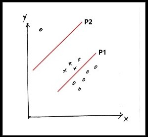

# Unidad 4: Aprendizaje Automático I

## Introducción
* Veremos los conceptos básicos para entender algoritmos mas avanzados de aprendizaje profundo.
* Aprendizaje Automático es una forma de aprendizaje estadístico aplicado y orientado al uso intensivo del poder de cómputo para estimar modelos grandes y complicados pero no tanto para estimar intervalos de confianza.
* Los modelos de aprendizaje Automático se estudian desde dos enfoques generales:
1) Estimadores de parámetros frecuentistas 
2) inferencia bayesiana. 

## Componentes de un modelo de aprendizaje automático.

Según Mitchell 1997, "Un programa de computadora se dice que aprende de la experiencia $E$, con respecto a algunas clases de tareas $T$, y medida de desempeño $P$, si su desempeño en tareas realizar tareas $T$, mejora con la experiecia $E$ según $P$". 

**Tarea $T$**: 
* Se refiere a la actividad principal de un sistema de aprendizaje. 
* Estas tareas son difíciles de ejecutar por programación fija hecha por humanos. 
* Aprendizaje automático (AA), ayuda a entender y responder preguntas científicas y filosóficas sobre los principios que subyacen la inteligencia.

Tareas $T$
Ejemplo de tareas que puede resolver el AA.

* Clasificación
* Clasificación con información incompleta.
* Regresión
* Transcripción
* Traducción computacional (Machine Translation. 
* Salida estructurada
* Detección de anomalías.
* Síntesis y generación de muestras.
* Reconstrucción de valores de entrada.
* Eliminación de ruido.
* Estimación de densidades de distribución

Despempeño $P$

Es necesario formular una medida de desempeño que guíe el aprendizaje del sistema. 

* Precisión (para tareas de clasificación, transcripción)
* Tasa de error. Esta debe plantearse de manera cuidadosa dependiendo del área de la aplicación.

Experiencia $E$
* Estas experiencias son proporcionadas por el conjunto de datos.
* Dos tipos de *Experiencias*: 
	* Supervisadas: Conjunto de datos que tienen asociados etiquetas. 
	* No supervisadas: No existen datos etiquetados a priori. El objetivo es aprender las distribuciones de probabilidad que mejor describan a los datos.

Existen otras Variaciones como por ejemplo:
	
	
* Semi supervisado. (algunos tienen etiquetas, otros no)

* Aprendizaje por refuerzo. El entorno que provee la experiencia cambia continuamente. 
	

Notas: La frontera entre un tipo y otro no están bien definidos. 

Comenzamos definiendo los *ingredientes* necesarios para generar un sistema de aprendizaje.

1) Un modelo. Es el ejecutante de la tarea $T$.
2) Una función de costo. Es la medida de desempeño $P$. Orienta al algoritmo de aprendizaje para optimizar su desempeño. 
3) Un algoritmo de aprendizaje. Se encarga de utilizar la experiencia $E$, para **optimizar** el desempeño $P$ del modelo ejecutando la tarea $T$.

## Regresión Lineal. 

El modelo consiste en procesar vectores de entrada $\mathbf{x} \in R^m$ y producir un pronóstico o predicción de salida $y \in R$.

La salida depende de una función lineal aplicada a $\mathbf{x}$.

Tarea $T$: predecir un valor $y$ dado una entrada $\mathbf{x}$.

$$\hat{y} = \mathbf{w}^T\mathbf{x}$$

donde $\mathbf{w}\in R^n$.

Desempeño $P$ en el conjunto conjunto de prueba. 

Tenemos una función de densidad que nos indica la probabilidad $p$ de que suceda $\mathbf{x}$ dado los parámetros $\theta$. Se escribe ($p(\mathbf{x}|\theta)$), esta función de densidad es la función de probabilidad normal $N(y|\mathbf{x},\sigma^2)$.

La derivación es como sigue:

1. Tenemos la función de la verosimilitud que es una funcion de distribucion de probabilidad $L(\theta) = N(\theta,\mathbf{x})$. Queremos maximizar esta función.

La verosimilitud es una función que depende de los parámetros de un modelo estadístico para realizar buenas inferencias acerca de su valor a partir de un conjunto de observaciones . En términos prácticos, sirve también como una medida de desempeño de un conjunto de parámetros $\theta$ considerando el conjunto de  datos $D$

$$N(\theta) = \sum_{i=0}^N ((\frac{1}{2\pi\sigma^2})^{1/2} e^{-\frac{1}{2\sigma^2}(\mathbf{w^T}\mathbf{x}_i-y_i)^2} )$$

2. Nos deshacemos de terminos que no influyen en la estimación de los parámetros multiplicamos ambas partes por el logartimo para trabajar con la log verosimilitud ($LL(\theta)$).

$$\text{log } L (\theta) =  LL(\theta) = \sum_{i=0}^N \text{ log }[(\frac{1}{2\pi\sigma^2})^{1/2} e^{-\frac{1}{2\sigma^2}(\mathbf{w^T}\mathbf{x}_i-y_i)^2}] $$

$$=\frac{1}{2} \sum_{i=0}^N (0 - \text{log}(2 \pi \sigma)^2))-\frac{1}{(2\sigma^2)} (\mathbf{w^T}\mathbf{x}_i-y_i)^2$$

$$= \frac{-1}{2\sigma^2} \sum_{i}^N (\mathbf{w^T}\mathbf{x}_i-y_i)^2 - \frac{N}{2} \text{log} (2 \pi \sigma^2)$$

3. Para adaptar la funcion a una de minimizacion usamos la log-verosimilitud negativa ($NLL(\theta) = -LL(\theta)$) 

$$\underset{\theta}{\text{ min }}  NLL(\theta) $$

$$NLL(\theta) =  \frac{1}{m} \sum_{i} (\hat{y}_i-{y}_i)^2$$

$$\text{MSE} = \frac{1}{m} \sum_{i} (\hat{y}_i-{y}_i)^2 $$

Esta la usaremos para construir la función objetivo.

$$ C(\mathbf{w}) =  \frac{1}{m}  || f(\mathbf{x,w})-\mathbf{y} ||^2_2  $$

donde $f(\mathbf{x,w}) = \mathbf{x}^T \mathbf{w}$

queremos minimizar por lo que formulamos el problema de optimización como

$$\underset{ \mathbf{w}} { \text{ min }} \frac{1}{m}   \sum _{i=1}^m  || f(\mathbf{x,w})-\mathbf{y} ||^2_2$$

$$\underset{ \mathbf{w}} { \text{ min }}  \frac{1}{m}  || \mathbf{X}^T\mathbf{w}-\mathbf{y} ||^2_2$$

$$\nabla_{\mathbf{w}} C(\mathbf{w}) = 0 $$

$$=\nabla_{\mathbf{w}} (\mathbf{X}\mathbf{w}-\mathbf{y})^T(\mathbf{X}\mathbf{w}-\mathbf{y})=0$$

$$=\nabla_{\mathbf{w}} (\mathbf{X}^T \mathbf{w}^T-\mathbf{y}^T)(\mathbf{X}\mathbf{w}-\mathbf{y})=0$$

$$=\nabla_{\mathbf{w}} (\mathbf{w} \mathbf{X}^T\mathbf{X}\mathbf{w}-\mathbf{w}^T\mathbf{X}^T\mathbf{y}-\mathbf{y}^T\mathbf{X}\mathbf{w}+\mathbf{y}^T\mathbf{y})=0$$

$$ \nabla_{\mathbf{w}} C(\mathbf{w}) =  2 \mathbf{X}^T\mathbf{X}\mathbf{w} - 2 \mathbf{X}^T\mathbf{y}=0$$

$$\mathbf{w} = (\mathbf{X}^T\mathbf{X})^{-1} 2 \mathbf{X}^T\mathbf{y} / 2$$

## Regresión Logística.

La regresión logística es un modelo estadístico que utiliza una **función sigmoidal** para modelar variables dependientes binarias. 

En términos geométricos, regresión logística trata de encontrar un plano que separe las clases **minimizando el error de clasificación**. 

Funciona con conjunto de datos linealmente separables.

Para clasificación binaria, si un hiperplano separa dos clases, entonces se dice que el conjunto de datos es **linealmente separable**.

### Interpretación geométrica

Ejemplo:

Tenemos un conjunto de datos  $D\in\{x_i,y_i\}_{i=1}^N$ donde $y_i\in \{-1,1\}$ es la etiqueta de clasificación y $x_i \in R^{m}$ 

 Para este conjunto de datos necesitamos una función (lineal) que nos ayude a separar los datos en dos clases. 

Para esto recurriremos a la ecuación general de la recta que separa dos clases:

$ax+by+c=0$

donde en aprendizaje automático para un hiperplano cualquiera se escribe como:

$$\mathbf{w}^T\mathbf{x}_i + b = 0$$,

y queremos encontrar los mejores parámetros $\mathbf{w},b$. que nos ayuden a **maximizar la precisión** (o minimizar el error)  de la clasificación en el conjunto de datos $D$

Si la línea pasa sobre el origen del hiperplano entonces el intercepto $b = 0$

Ejemplo:

Dado un conjunto $D\in\{x_i,y_i\}_{i=1}^m$ donde la respuesta esta dada por una variable binaria  $y_i\in \{-1,1\}$ y  la variable independiente es  $x_i \in R^{n}$, encontrar un hiperplano que pueda separar ambas clases de la mejor manera posible.

Ejemplo "hiperplano" bidimensional

Pasos para encontrar el hiper plano gráficamente que separa dos clases.

1. Ubicar en el plano los pesos $P(w_1,w_2)$ con respecto al origen. Desplazar si $b \neq 0$ y trazar el vector. 
2. Encontrar un hiperplano perpendicular al vector de pesos en el plano.
3. El lado al que apunta el vector de pesos es el lado $\mathbf{w^T x + b}>0$, 

Los pesos $\mathbf{w}$ se representan geométricamente en un plano como un punto $P=({w_1},{w_2})$, el cual a su vez es la terminación un vector con dirección ortogonal a la frontera de decisión.

Ejemplo *: 

1. Dibujar el plano separador correspondiente a los pesos $w_1 = 1, w_2 = -1$

2. Dibujar el plano separador correspondiente a los pesos $w_1 = 2, w_2 = 4, b=2$

Para encontrar el plano perpendicular $\mathbf{v}$ recordar que $\mathbf{w}\cdot \mathbf{v} = 0$

Para probar a que clase pertenece un punto $x_i$ es necesario acordarnos de la fórmula para medir la distancia  mas cercana de un punto $x_i$ a la recta. 

(Distancia Sin intercepto)

$$d_i = \frac{\mathbf{w}^T \mathbf{x_i}} {||\mathbf{w}||}$$

(Distancia con intercepto)

$$d_i = \frac{\mathbf{w}^T \mathbf{x_i} +b} {||\mathbf{w}||}$$

donde $\mathbf{||w||} = (\sum_{i=1}^{m}w_i^{2}) ^{1/2}$ **es la magnitud o módulo del vector**.

Por lo tanto si $d_i$>0 entonces $x_i$ pertenece a la clase positiva.

**Ecuación General del hiperplano**

$ax+by+cz+d=0$

*nota: hiperplano o plano se utilizan en este apartado indistintamente*

Dado un vector con dirección en R$^{m}$,  con $m>1$, hay infinitos hiperplanos perpendiculares. Si se conoce un punto un inicial $P_0$ de un hiperplano perpendicular a la dirección en R$^{m}$, entonces este queda definido.

Ejemplo.:
¿Cual es la ecuación del plano $\pi$ que pasa por el origen con coordenadas $P_0$ y es perpendicular al vector $\mathbf{w} = [w_1,w_2,w_3]^T$? 

*Esta ecuación del plano  es la frontera de decisión de nuestro clasificador*.

$\mathbf{w}^T \mathbf{x} = 0$

Dado un punto $P_0 = \mathbf{x}^0 = [x_1^0,x_2^0,x_3^0] = [0,0,0]$ que es el  punto que pasa por el origen, y el vector $\mathbf{w}$ encontrar la ecuación del hiperplano.

Para encontrar la ecuación del hiperplano se requiere otro punto $P$ que forma parte del hiperplano y expresa como $P \in \pi$, donde $P= \mathbf{x} = [x_1,x_2,x_3]$ no lo conocemos pero  satisface el producto interno:

 $\overrightarrow {P_0 P} \cdot \overrightarrow{\mathbf{w}}=0$

$\overrightarrow {P_0 P} = [(x_1 -x^0_1),(x_2-x_2^0),(x_3-x_3^0)]$

$[(x_1-x^0_1),(x_2-x_2^0),(x_3-x_3^0)] \cdot (w_1,w_2,w_3) = 0$

$w_1(x_1-x_1^0)+w_2(x_2-x_2^0)+w_3(x_3-x_3^0) = 0$

agrupando términos

$w_1x_1 + w_2x_2 + w_3x_3 + (-w_1x_1^0 -w_2x_2^0-w_3x_3^0) = 0$

donde: $d= (-w_1x_1^0 -w_2x_2^0-w_3x_3^0)$

por lo tanto la ecuación general del plano es:

$w_1x_1 + w_2x_2 + w_3x_3 + d = 0$

Ejercicio (1.a). En una dimensión $m = 2$. Encontrar la ecuación del plano $\pi$ que pasa por las coordenadas $P_{0} = [0,0]$ y es la frontera de decisión de un clasificador lineal con pesos $\mathbf{w}=[1,2]$.

Respuesta:

paso 1. Sustituir valores en la ecuación de la recta $w_1x_1 + w_2x_2 + (-w_1^0x_1 -w_2x_2^0) = 0$

paso 2. Simplificar.

1.b Dibujar la frontera de decisión en el plano.

$w_1 x_1 +w_2x_2 = 0$

$w_1 x_1 / w_2 = x_2$

(se hace despejando la variable dependiente, en este caso $x_2$)

1.c  Igual que el ejercicio 1.a pero ahora $P_0=[0,2]$

$w_1x_1 + w_2x_2 + w_3x_3 + (-w_1x_1^0 -w_2x_2^0-w_3x_3^0) = 0$

$1*x_1+2*x_2 + (-1*0-2*2) = 0$

$d = 0-4 = -4$

$1*x_1+2*x_2 -4 = 0$

$1*x_1-4 = -2*x_2 $

$(x_1-4)/-2 = x_2$

1.d Extra. Extender el ejercicio (1.a) a 3 dimensiones ( $m =3$), con  $P_0 = [0,0,0]$ y $\mathbf{w}=[2,3,4]$

### Regresión logística

**Entendiendo el papel de la regresión logística para resolver tareas de clasificación**

Una primera formulación de la función objetivo intuitiva partiendo de la regresión lineal es:

$$\hat{\mathbf{w}} = \underset{\mathbf{w}}{\text{ arg max }} \sum_{i-1}^N (y_i \cdot (\mathbf{w}^T \mathbf{x}_i+b)) $$  

Esta función estará sumando valores positivos siempre y cuando se cumpla $sign(\mathbf{w}^T \mathbf{x}_i+b) = sign(y_i)$

Problema de esta formulación: Es muy sensible a los  datos atípicos (outliers).

**La sigmoide**

$$sigm(z) = \frac{1}{1+exp(-z)}$$

Esta función regresa valores entre 0.5 y 1 cuando $y_i(\mathbf{w}^T \mathbf{x}_i + b)>0$*

Esta función regresa valores entre (0, 0.5) en caso contrario.

**Formulación de la regresión logística con la distribución de probabilidad de Bernoulli**

 La regresión logística supone que para cada dato dato $i$, $(\mathbf{x}_i,y_i)$, ($\mathbf{x}_i \in \mathbf{R}^{m}, y_i \in \{0,1\}$) tomado de un 

1) Conjunto de datos independientemente distribuidos 

2) de una misma distribución de probabilidad, 

3)  linealmente separables, 

4) existe una probabilidad de que  $\mathbf{x}_i$ pertenezca a una clase $y_i$ dada por una función sigmoidal. 

$p(y_i=1|\mathbf{x}_i)=sigm(z)$

donde $z = \sum_{i=1}^m w_ix_i +b$

y por la ley de la probabilidad definida por el complemento 

$p(y_i=1|\mathbf{X=x}_i) + p(y_i=0|\mathbf{X=x}_1) = 1$

Podemos concluir que:

$p(y_i=0|\mathbf{X=x}_i)=1 - sigm(z)$

Utilizando esta suposición es posible formular un algoritmo que a partir de un conjunto de datos clasificados   $$D = \{(\mathbf{x}_i,y_i)\}^N_{i=1}$$,  obtener los mejores valores de los parámetros para maximizar la precisión de nuestro clasificador. 

Una manera es formulando una **función de costo** $C(\theta)$ a minimizar (e.g, minimizar el error de clasificación), o en el caso estadístico, maximizando la verosimilitud. Esto se hace en dos pasos generales:

1. Formulando la función de verosimilitud $L(\theta)$.
2. Encontrar los valores $\theta =  \{\mathbf{w}\}$ que maximizan la función de verosimilitud.

Equivalentemente en optimización 

1. Formulando una función de costo $C(\theta)$.
2. Encontrar los parámetros $\mathbf{w} $ que minimicen la función de costo.

Como las variables a clasificar son binarias, la salida de la función logística se interpreta como probabilidad de pertenencia a una clase. Por lo tanto podemos interpretar cada etiqueta como una variable aleatoria de Bernoulli $Y \sim Ber(p)$ donde $ p=sigm(\mathbf{w}^T\mathbf{x}+b)$.

Entonces utilizando la función de probabilidad de Bernoulli podemos evaluar en una sola expresión **la probabilidad de que un vector de entrada $\mathbf{x}_i$ este correctamente clasificado en la clase $y_i$,** (de otro modo, la probabilidad de que un dato pertenezca a una clase $y_i$ indistintamente de su etiqueta.)

$P(Y=y_i|\mathbf{X}=\mathbf{x}_i) = sigm(\mathbf{w}^T\mathbf{x}_i +b)^y \cdot [1-sigm(\mathbf{w}^T\mathbf{x}_i +b)]^{(1-y)}$

Analicemos con detenimiento los exponentes de esta función. 

Si $y=0$ entonces la primera parte de la ecuación sería 1 multiplicado por la probabilidad de que $y=0$.

$P(y_i=0|\mathbf{X}=\mathbf{x}_i) = 1*(1-p)$

Pregunta:

Si $y=1$ entonces la primera parte de la ecuación sería :     Que multiplica a:

$P(y_i = 0 | X = x_i) = p*1$

La verosimilitud se puede expresar como un **producto de probabilidades de eventos independientes** :

 $L(\theta)  =  \prod_{i=1}^m p(Y=y_i | X= \mathbf{x}_i,\theta) $ 

y una implementación plausible es usando la función de probabilidad de Bernoulli.  Con una simple sustitución tenemos:

 $L(\theta)  = \prod_{i=1}^m sigm(\mathbf{w}^T\mathbf{x}_i +b)^{y_i} \cdot [1-sigm(\mathbf{w}^T\mathbf{x}_i+b)]^{(1-{y_i})} $ 

$L(\theta)  = \prod_{i=1}^m p_i$

Esta función nos sirve para medir el desempeño. 

Podemos simplificarla por razones de estabilidad numérica removiendo componentes exponenciales que dificultan al tratamiento numérico durante la optimización, por lo tanto formulamos la log-verosimilitud.

 $\text{ log } (L(\theta)) = LL(\theta)$ 

Esta expresión se escribe:

$LL(\theta) = log (\prod_{i=1}^m  sigm(\mathbf{w}^T\mathbf{x}_i +b)^{y_i} \cdot [1-sigm(\mathbf{w}^T\mathbf{x}_i+b)]^{(1-{y_i})})$ 

Qué paso sigue? **Acordarse de las propiedades de los Logaritmos!!!.**

$LL(\theta) = \sum_{i=1}^m (y_i \text{ log } sigm(\mathbf{w}^T \mathbf{x}_i+b) + (1-y_i) \text{ log } [1-sigm(\mathbf{w}^T \mathbf{x}_i+b)])$

Esta expresión la usaremos para construir nuestra función objetivo a maximizar.

$\mathbf{w},b = \underset{\theta = \{\mathbf{w},b\}}{\text{arg max }} LL(\theta)$

O minimizar

$\mathbf{w},b = \underset{\theta = \{\mathbf{w},b\}}{\text{arg min }} NLL(\theta)$

Procedemos a utilizar optimización numérica para aproximarnos a la solución.

Seleccionamos el algoritmo de gradiente ascendente para maximizar, (descendente para minimizar $-LL(\theta)$), la función $LL(\theta)$. 

Para esto requerimos la derivada parcial $\frac{\partial LL(\theta)}{\partial \theta_j} $ para cada parámetro que compone al gradiente. Está función dirigirá los parámetros hacia el óptimo utilizando un algoritmo de optimización.

$\frac{\partial LL(\theta)}{\partial \theta_j} = \sum_{i=1}^n [y_i-sigm(\theta^T\mathbf{x}_i+b)]x_j$

## Sobre ajuste, sub ajuste , Dimensión VC.

* Una meta de los algoritmos de aprendizaje automático es que no solo se ajusten a un conjunto de datos fijo, si no que sean capaces de generalizar el comportamiento con conjuntos de entradas no vistas.   
* Hasta el momento hemos entrenado modelos optimizando el ajuste de parámetros sobre un conjunto de datos que le llamaremos **Conjunto de entrenamiento**.
* Para  hacer que nuestro proceso de optimización sea uno de aprendizaje automático, tenemos que considerar la medición del **error de prueba** con un **conjunto de datos de prueba**. Este conjunto se deja fuera del proceso de optimización y se utiliza con el modelo optimizado para medir su **error de generalización**

Es posible mejorar el desempeño de generalización cuando:

* Se asume que los datos provienen de un mismo proceso de generación de datos.
* La seleccion de la muestra son independientes.
* Los conjuntos de entrenamiento y prueba son identicamente distribuidos, de una distribución de probabilidad.

Esto nos permite asumir que encontraremos una aproximación que describa el proceso de generación de datos con una distribución de probabilidad.

Este generador se llamara **distribución de generación de datos** denotado por $p_{data}$.

Esto nos permite estudiar la relación que existe entre el error de entrenamiento y de prueba.

* En un algoritmo de aprendizaje automático queremos reducir el error en el conjunto de entrenamiento y despues probarlo en el conjunto de prueba esperando que el error de este último sea al menos igual que el conjunto de entrenamiento.

Los dos aspectos que determinan el desempeño de un modelo de aprendizaje automático es:

1. Hacer el error de entrenamiento pequeño
2. Hacer que la separación del error entre el conjunto de entrenamiento y prueba sea el menor posible.

Esos aspectos ayudan a detectar el 

1. Sub-ajuste. El modelo es incapaz de ajustarse apropiadamente a los datos. 
2. sobre ajuste. La distancia entre error de entrenamiento y prueba es grande. 

Se puede controlar el ajuste alterando o manipulando su **capacidad**.

**Capacidad**: Es la habilidad del modelo para ajustarse a una gran cantidad de funciones. 

Una manera de controlar la capacidad es seleccionando su espacio hipotético, el cual contiene una familia de funciones acotada por su estructura. Por ejemplo una familia de regresiones lineales.

$\hat{y} = {w_1}x +b$

Se puede aumentar su capacidad para representar otras funciones agregando $x^2$

$\hat{y}= w_1 x +w_2*x^2 + b + \lambda \mathbf{w}^T \mathbf{w}$

Generalizando, podemos controlar la capacidad e ajuste determinando el orden del polinomio.

$$\hat{y} = \sum_{i=1}^{i=q} w_i x^i +b$$

Para el caso de un algoritmo de aprendizaje automático, estos se desempeñan bien cuando la capacidad de ajuste es apropiada para el problema.

La capacidad de seleccionar un modelo de una familia de funciones,  al mover los parámetros. Se le llama **capacidad representacional**.

Dado a la imperfección de los algoritmos de optimización, la **capacidad de representación** efectiva es por lo regular menor que la **capacidad representacional**.

**Regularización**

Es común que en aprendizaje profundo estemos ajustando modelos con una capacidad representacional tan alta que nos produzca un sobre ajuste.

**Definición**

**Regularización:** Es cualquier modificación que hacemsos a un algoritmo de aprendizaje con el objetivo de reducir su generalizacion de error pero no su error de entrenamiento. 

Regularización es uno de los problemas mas importantes de estudio a la par de optimización.

Para *regular* este efecto, una solución es agregando un regularizador a la función objetivo.

$$J(\mathbf{w})= \sum_{1=i}^N [f(\mathbf{w},\mathbf{x}_i)-y_i)]^2 + \lambda \mathbf{w}^T\mathbf{w}$$

$\lambda$ regula la preferencia que tenemos por valores pequeños en los parámetros.

* Es un valor de penalización que regula el sobre ajuste de una función con alta capacidad representacional, como los son las redes neuronales en general.

Retomando el ejemplo del modelo polinomial, podemos regular su capacidad representacional.

(Ver figura 5.5 Y. Bengio Deep Learning)

**Dimensión VC (Dimensión Vapnik-Chervonenkis)**
Es una medida teórica de capacidad del modelo propuesta por [Vladimir Vapnik](https://es.wikipedia.org/w/index.php?title=Vladimir_Vapnik&action=edit&redlink=1 "Vladimir Vapnik (aún no redactado)") y [Alexey Chervonenkis](https://es.wikipedia.org/w/index.php?title=Alexey_Chervonenkis&action=edit&redlink=1 "Alexey Chervonenkis (aún no redactado)").

Es el valor mas grande posible de $m$ puntos arbitraria y binariamente clasificados, para el cual existe un clasificador que pueda obtener un error 0 de clasificación.

Es el máximo número de puntos $m$ perteneciente a alguna clase binaria, que pueden ser dispuestos de manera arbitraria de tal manera que el clasificador pueda clasificarlos correctamente.

[Figura de ejemplo Pendiente calcular dimensión VC con una linea y con algún otro modelo, Mientras se puede seguir el ejemplo de wikipedia] 

https://en.wikipedia.org/wiki/Vapnik%E2%80%93Chervonenkis_dimension

## Validación de modelos, Validación cruzada.

Esta basada en la idea en que si el conjunto de datos original se parte aleatoriamente en conjunto de entrenamiento y prueba varias veces se obtiene una buena medida de error de generalización.

No se puede utilizar con conjuntos de datos grandes que representen una carga computacional importante. 

Con conjuntos relativamente pequeños si es posible.

Por cada partición diferente se obtiene un error de generalización, a estos se les promedia $\mu_{cross} = \frac{1}{k}\sum_{i=1}^k e_i$, y se calcula su intervalo de confianza $\sigma_{cross},\mu_{cross}$. 

Ver algoritmo 5.1 pág 120.

**Referencias**

*Machine Learning: a Probabilistic Perspective*. by Kevin Patrick Murphy. MIT Press, 2012.

https://aga.frba.utn.edu.ar/blog/2016/09/08/ecuaciones-del-plano/

https://towardsdatascience.com/geometric-interpretation-of-logistic-regression-4f85047a5860

https://towardsdatascience.com/introduction-to-logistic-regression-66248243c148
https://towardsdatascience.com/cross-entropy-for-classification-d98e7f974451

https://mathinsight.org/distance_point_plane_examples

https://quimicayalgomas.com/wp-content/uploads/2015/03/logaritmos-propiedades.png

Derivación de la función sigmoide por regla de la cadena y regla del cociente.
https://hausetutorials.netlify.app/posts/2019-12-01-neural-networks-deriving-the-sigmoid-derivative/#:~:text=The%20derivative%20of%20the%20sigmoid%20function%20%CF%83(x)%20is%20the,1%E2%88%92%CF%83(x).

Fórmulas derivadas
http://3con14.com/%E2%94%80-an%C3%A1lisis/80-05-derivadas/184-e-%C2%B7-tabla-de-derivadas-f%C3%B3rmulas.html

> Written with [StackEdit](https://stackedit.io/).